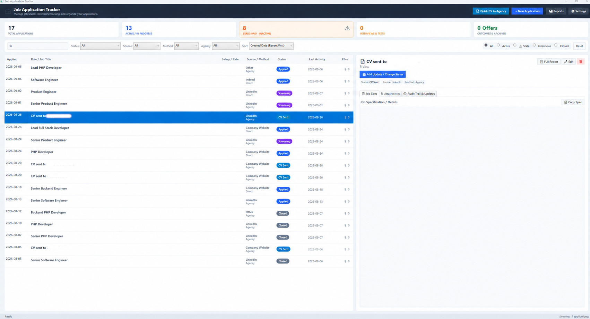

# JobAppTracker

A native Windows desktop application built with **C#**, **.NET 8 WPF**, and a local **SQLite** database, designed specifically for job seekers to track, audit, organize, and report on job applications and recruitment agency submissions.

> **Built with Google Antigravity**: This project was developed using **Google Antigravity**.



---

## Key Features

### 1. Application & Agency Submission Tracking
- **Standard Job Applications**: Record applied date, job title, company name, agency (if applicable), application method, source channel, salary/rate, location, URL link, and full job description.
- **Speculative Agency "CV" Submissions**: Dedicated 1-click toggle and button to log speculative CV submissions to recruitment agencies (auto-titled as `"CV"`).
- **Salary / Rate Tracking**: Record compensation details (e.g. `£70,000` or `£550/day`), prominently displayed in both the main dashboard list and reports.
- **Job Posting URL**: Direct clickable browser launch to original job ads or company portals.

### 2. Full Job Specifications & Document Attachments
- **Full Pasted Job Spec**: Dedicated multi-line scrollable text viewer/editor with live character count and a 1-click **"Copy Spec"** button.
- **Managed File Attachments**: Attach PDFs, Word documents (`.docx`), text files, or images. Files are safely copied to a managed local folder (`%LOCALAPPDATA%\JobAppTracker\Attachments\{application_id}\`) with options to open directly or reveal in Windows File Explorer.

### 3. Comprehensive Audit Trail & History
- **Date-Stamped Event Log**: Full reverse-chronological timeline of all events recorded against each application.
- **Selectable & Copyable Text**: All note text, titles, and event descriptions can be highlighted and copied with mouse/keyboard (`Ctrl+C`), right-click context menus (`📋 Copy Notes Text`, `📋 Copy Full Entry`), or via 1-click `📋` copy buttons on each event card.
- **Audit Record Editing & Status Correction**: Edit existing notes or correct mistakenly chosen status updates (`✏️ Edit Record`) directly from the timeline. Event dates remain locked to preserve chronological integrity, and editing the latest status event automatically synchronizes the parent application's status.
- **Chronological Sequence & Deduplication**: Timelines and status histories maintain deterministic forward ordering (`UpdateDate ASC, CreatedAt ASC, Id ASC`) with automatic deduplication of consecutive identical statuses.
- **Automated Tracking**: Logs initial submission, status transitions (`Applied ➔ 1st Interview`), file attachments, notes, and recruiter phone calls.
- **Automatic Date Refresh**: Refreshes the application's `LastUpdatedDate` whenever any activity occurs.

### 4. Staleness Tracking & Smart Inactivity Alerts
- **Configurable Inactivity Threshold**: Defaults to 14 days without updates or response.
- **Visual Alert Badges**: Amber alert pills (`⚠️ Stale (X d inactive)`) and relative age indicators (`Updated today`, `Updated yesterday`, `X d ago`).
- **Quick Filters**: Dedicated **"⚠️ Stale"** filter button on the main dashboard to immediately isolate dormant applications needing follow-up.
- **Finalized Applications**: Selecting final outcomes (`Accepted`, `Rejected`, `Closed`, `Closed due to inactivity`, `Discussed, bad fit`, `Employer changed role`, `Withdrawn`) halts staleness tracking.

### 5. Multi-Criteria Filtering & Sort Sequencing
- **Flexible Sorting**: Sort by **Last Activity Date** or **Created / Application Date** (both Ascending and Descending).
- **Report Date Range Selection**: Choose whether date range filtering is based on **Applied / Created Date** or **Last Activity Date**.
- **Company Filter**: Dedicated company dropdown to quickly isolate all applications submitted to a specific employer (e.g. *Acme Tech Solutions*).
- **Agency Filter**: Dedicated agency dropdown to isolate multiple positions or CV submissions handled by the same agency (e.g. *Hays*, *Michael Page*).
- **Expanded Status Options**: Comprehensive status list including `"Closed due to inactivity"`, `"Discussed, bad fit"`, `"Employer changed role"`, and `"Role Cancelled / On Hold"`.
- **Dynamic Source Management**: Add custom sources (e.g. *Otta*, *Cord*, *AngelList*) on the fly, with auto-persistence to SQLite and full management in Settings.
- **"All except closed/complete" Filter**: Quick selection in both the dashboard and reports to filter out closed, withdrawn, or rejected applications, displaying only active pursuits.

### 6. Printable Reports, Dossiers & Data Export
- **Printable HTML Reports ("Job Applications Report")**: Professional browser-based reports formatted with `@media print` styling, ready to print or save to PDF. Includes salary/rate, active sort order, date range field grounding, and summary KPI cards.
- **Overall Totals ("X of Y" Context)**: When filtering reports (by date range, status, agency, or search query), KPI metric cards display comparative metrics in `"X of Y (Z%)"` format (e.g. `6 of 18 (33%) Active`), instantly revealing how the filtered subset compares to the overall database totals in both the interactive viewer and printable HTML export.
- **Flexible History Reporting Modes**:
  - **None**: Standard concise table view.
  - **Status changes only (dates & statuses)**: Generates a short, clean status progression timeline (e.g. `2026-08-01: Applied ➔ 2026-08-10: 1st Interview ➔ 2026-08-20: Closed due to inactivity`) without long recruiter notes or full text details.
  - **Full audit trail**: Complete event history with all recruiter notes, interview logs, and details.
- **Single Application Detailed Report / Dossier**: Generate a full dossier for a single vacancy including full job spec, complete chronological history timeline, and a metadata list of attached documents (without exposing file binaries).
- **CSV Export**: Export all records or filtered views to CSV for Microsoft Excel and Google Sheets, supporting both full audit notes or concise status change history.
- **Summary Clipboard Export**: Copy formatted markdown/text summaries directly to the clipboard.

---

## Project Structure

```
JobAppTracker/
├── Data/
│   └── DatabaseService.cs       # SQLite database connection, migrations, and CRUD operations
├── Models/
│   ├── ApplicationFilter.cs     # Multi-criteria filter, sort parameters, and report metrics models
│   ├── ApplicationUpdate.cs     # Audit trail event model
│   ├── Attachment.cs            # File attachment metadata model
│   └── JobApplication.cs        # Primary job application data model
├── Services/
│   ├── AttachmentService.cs     # Attachment management, file launching, and browser opening
│   └── ExportService.cs         # HTML printable report, single-app dossier, and CSV export engine
├── ViewModels/
│   ├── MainViewModel.cs         # WPF MVVM ViewModel for dashboard state, filtering, and commands
│   └── RelayCommand.cs          # ICommand implementation
├── Views/
│   ├── AddSourceDialog.xaml       # Dialog to add custom application sources
│   ├── AddUpdateWindow.xaml       # Add note / status update dialog
│   ├── ApplicationEditWindow.xaml # Create / Edit application dialog & attachment manager
│   ├── EditUpdateWindow.xaml      # Edit audit trail event & correct status dialog
│   ├── ReportsWindow.xaml         # Dedicated reporting, analytics & export window
│   └── SettingsWindow.xaml        # Preferences, staleness threshold & custom sources manager
├── Converters/                  # WPF XAML value converters (staleness, visibility, dates)
├── Tests/                       # Automated standalone verification test suite (21 test suites)
│   ├── JobAppTracker.Tests.csproj
│   └── Program.cs
├── MainWindow.xaml              # Primary application window & interactive dashboard
├── App.xaml                     # Application entry point & global modern theme styling
├── JobAppTracker.csproj         # Main .NET 8 WPF project file
└── .gitignore                   # Git exclusion rules for .NET, Visual Studio, and OS files
```

---

## Getting Started

### Prerequisites
- **Windows 10 / 11**
- **.NET 8.0 SDK** (or later)

### Build & Run

1. **Clone or navigate to the repository**:
   ```powershell
   cd h:\Dev\AntiGravity\JobAppTracker
   ```

2. **Restore dependencies & build**:
   ```powershell
   dotnet build -c Release
   ```

3. **Run the desktop application**:
   ```powershell
   dotnet run
   ```
   *Or launch the compiled binary directly from `bin\Release\net8.0-windows\JobAppTracker.exe`.*

---

## Running the Automated Tests

The solution includes a comprehensive, standalone automated test suite (21 test suites) covering SQLite database operations, CV submissions, staleness tracking, audit trail logging, agency filtering, custom sources, sort sequencing, HTML/CSV exports, single application dossiers, "All except closed/complete" filtering, new finalized statuses, date filtering (Created vs Last Activity), short status changes reporting, audit record editing with parent status synchronization, chronological ordering & deduplication, filtered overall totals ("X of Y" style), and dedicated company filtering:

```powershell
dotnet run --project Tests/JobAppTracker.Tests.csproj
```

---

## Building the Windows Installer

To build a standalone, self-contained Windows Installer (`JobAppTrackerSetup.exe`):

1. Ensure **[Inno Setup 7](https://jrsoftware.org/isinfo.php)** is installed.
2. Run the automated build script:
   ```powershell
   .\build-installer.ps1
   ```
This script executes the test suite, publishes the self-contained 64-bit application, and compiles the installer into `dist\JobAppTrackerSetup.exe`.

---

## Data Storage Locations

By default, application data and attachments are stored locally on your machine in:
- **SQLite Database**: `%LOCALAPPDATA%\JobAppTracker\job_applications.db`
- **File Attachments**: `%LOCALAPPDATA%\JobAppTracker\Attachments\{application_id}\`

No external cloud services or databases are required; your job search data remains 100% private and offline on your computer.

---

## License

This project is licensed under the [MIT License](LICENSE).
